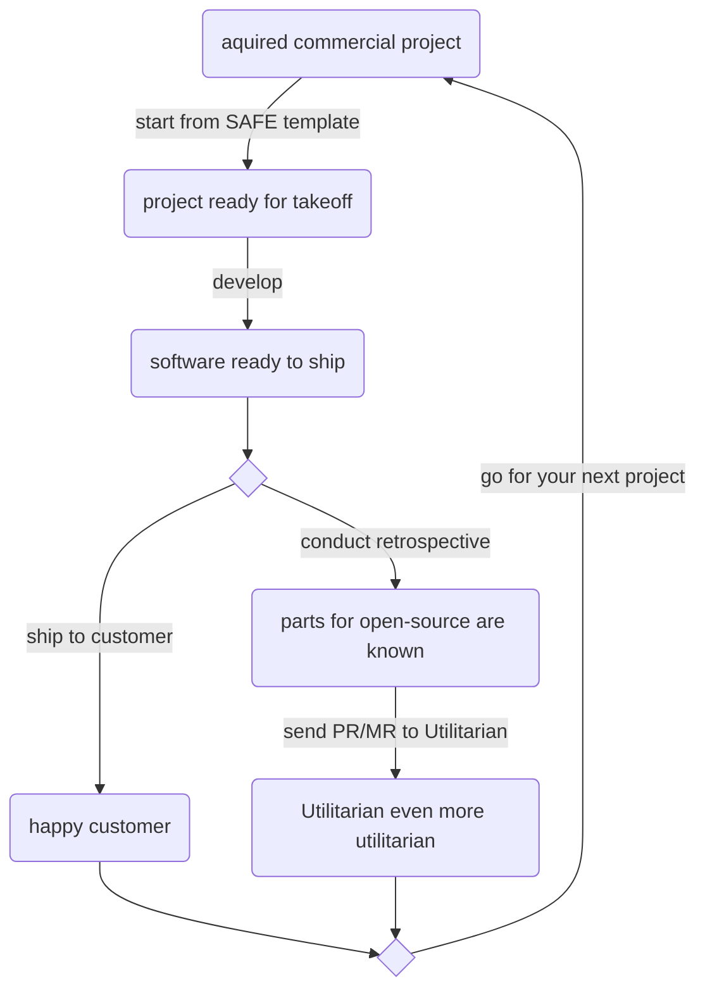

# Contributing to Utilitarian

- [Contributing to Utilitarian](#contributing-to-utilitarian)
- [The canonical way to contribute](#the-canonical-way-to-contribute)
  - [Repository structure](#repository-structure)
  - [Templates](#templates)
    - [Gitlab](#gitlab)
    - [Github](#github)
  - [Maintainers](#maintainers)

# The canonical way to contribute
It is desirable to incorporate as much real-world use and experience into this project. The following personal workflow is suggested. If you have any questions, do not hesitate to contact [the maintainers](#Maintainers)

## Repository structure
I plan to use the [CHANGELOG](CHANGELOG.md) at repository level for long-term documentation of developing experience with SAFE in real world project and to keep track of DevOps and infrastructural changes or new features that affect all projects within the repository

Every application or library within this repository is supposed to have its own release cycle, with a `CHANGELOG.md` located within its subfolder.

The repository will be maintained according to [GitLab Flow](https://docs.gitlab.com/ce/workflow/gitlab_flow.html). For now, the project follows the [mono repo](https://medium.com/@maoberlehner/monorepos-in-the-wild-33c6eb246cb9) pattern, since centralization of knowledge in a executable way is the main intent of this project. Once this leads to problems, there is still the [meta repo](https://medium.com/@patrickleet/mono-repo-or-multi-repo-why-choose-one-when-you-can-have-both-e9c77bd0c668) to try out. I think the modular and versatile nature of the [FAKE build system](https://fake.build/) and the powerful [Paket package manager](https://fsprojects.github.io/Paket/index.html)  with its [independent resolution groups](https://fsprojects.github.io/Paket/groups.html) will make it scale though.

## Templates

There is a set of initial issue templates in place to communicate different intents:

### Gitlab
* [research proposal](.gitlab/issue_templates/Research_Proposal.md)
* [feature proposal](.gitlab/issue_templates/Feature_Proposal.md)
* [bug report](.gitlab/issue_templates/Bug.md)

### Github
* [research proposal](.gitlab/issue_templates/Research_Proposal.md)
* [feature proposal](.gitlab/issue_templates/Feature_Proposal.md)
* [bug report](.gitlab/issue_templates/Bug.md)

## Maintainers
| Name        | Github           | Gitlab  | Twitter | Slack 
| ------------- |:-------------:| :-----:| :-----:| :-----:|
| Kai Friedrich | [kfrie](https://github.com/kfrie) | [kfrie](https://gitlab.com/kfrie) | [@taleOfFsharp](https://twitter.com/taleOfFsharp) | [kfrie](https://fsharp.slack.com/team/U8XU0S362)
